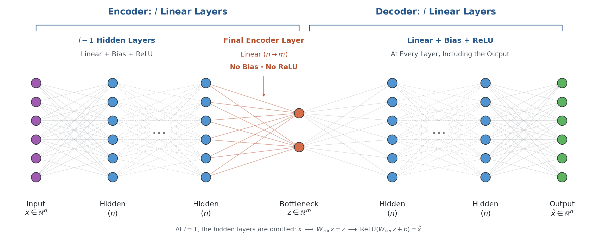
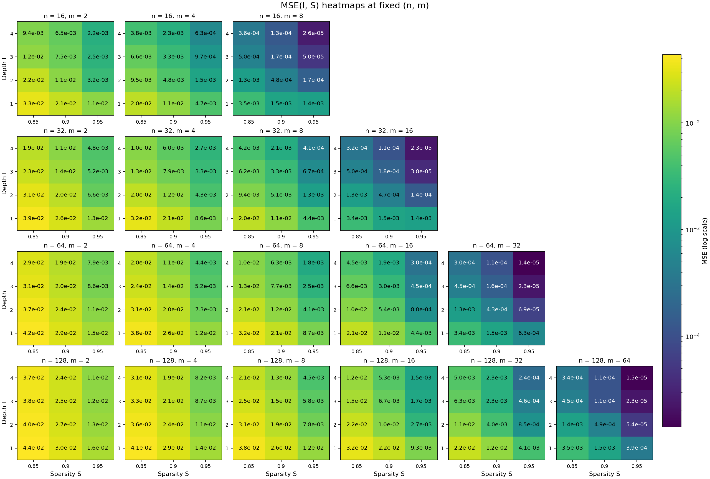
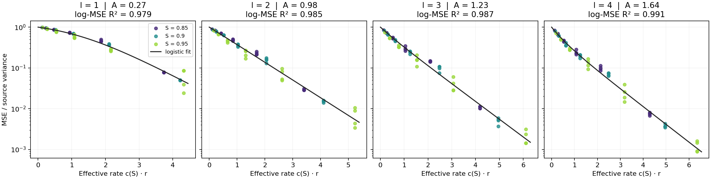
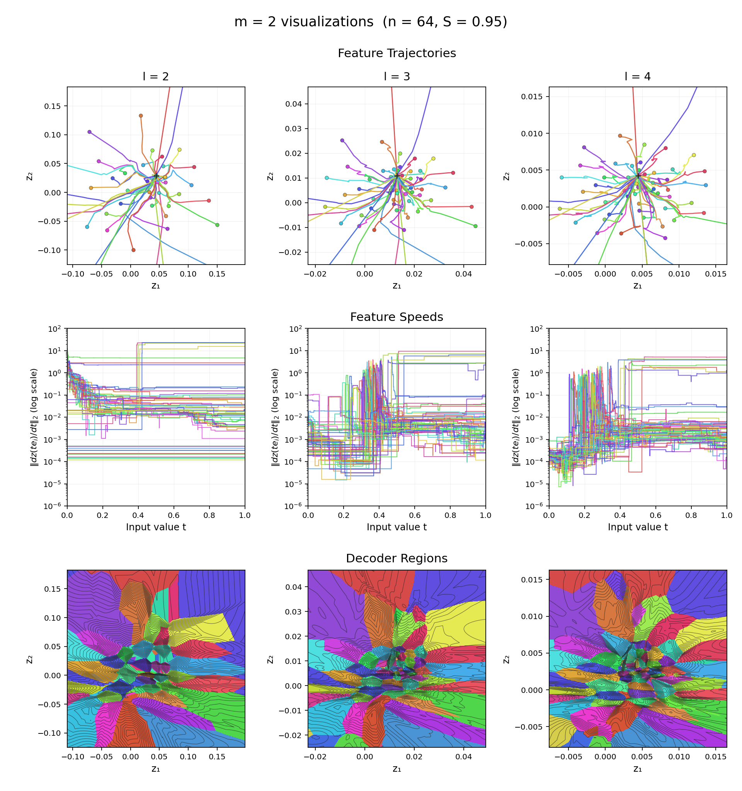
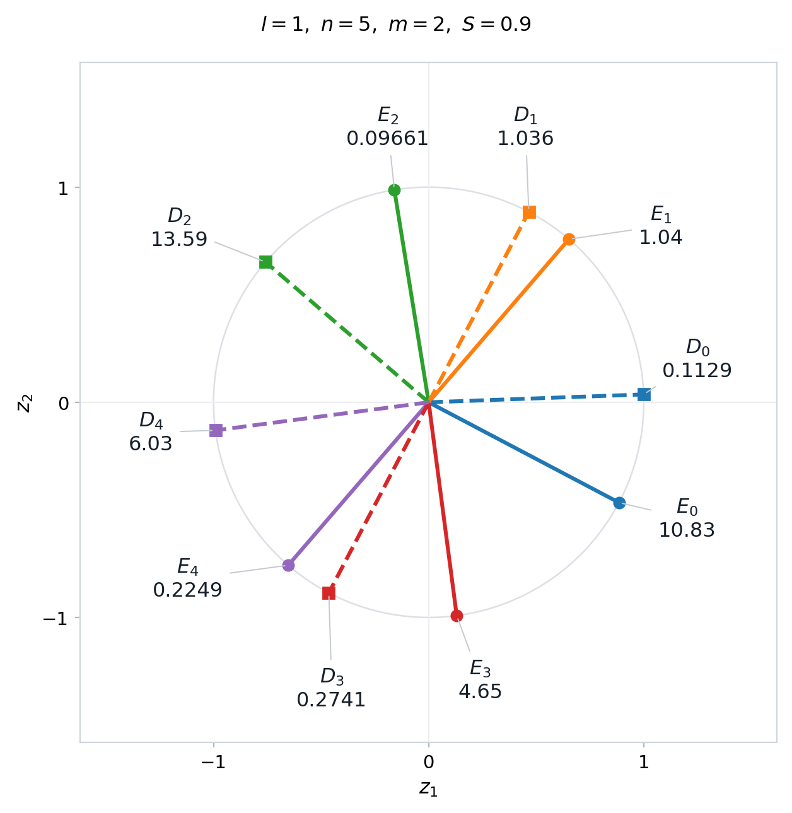
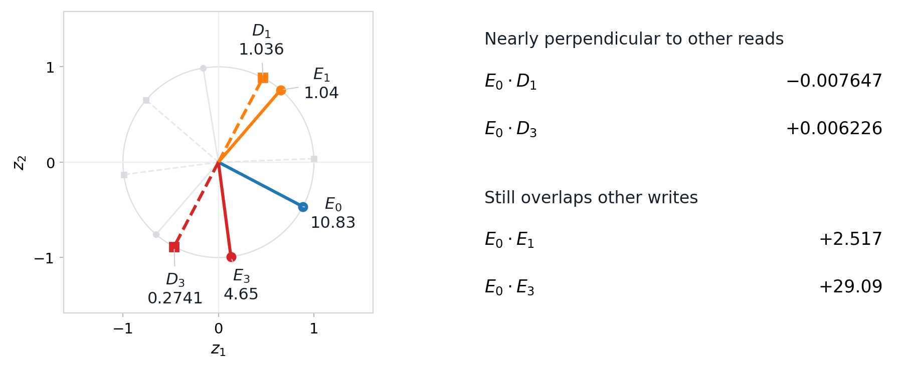
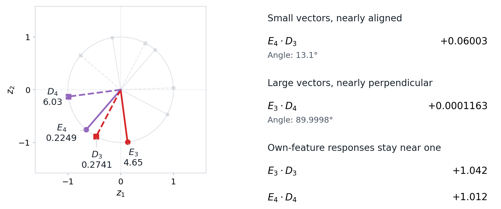
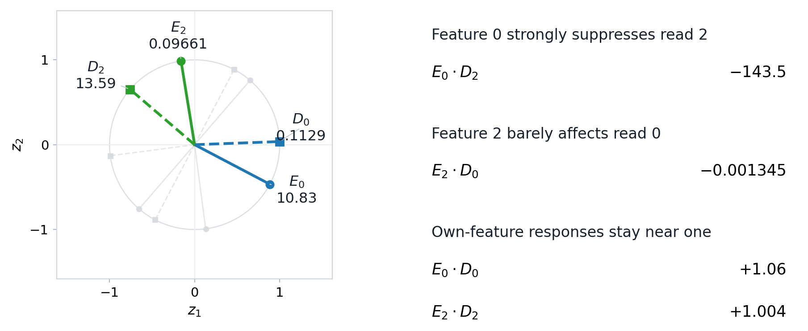
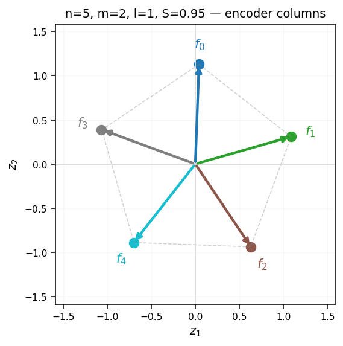

# A Toy Model of Nonlinear Features

This project builds on *Toy Models of Superposition* [\[1\]][tms] (referred to as TMS throughout) by allowing the encoder to be nonlinear. The project is divided into 2 sections of toy-model results meant to demonstrate existence proofs of the various phenomena. In [Nonlinear Representations](#nonlinear-representations), we study how depth allows the model to compress the features as nonlinear functions of the activations and visualize what that looks like. In [Tied vs. Untied Weights](#tied-vs-untied-weights), we look into the solutions that untying decoder weights allows the model to find.

The research direction, experimental design, and summary are largely my own, but the implementation of these experiments made heavy use of coding agents (mostly GPT-6 Astra and Fable 5.1). 

## Nonlinear Representations

### Experimental Setup

#### Data

The data exactly mirrors the setup from TMS except that we don't weight the features by importance in our main analysis. Each input is a sparse, non-negative vector with n independent features. A feature is zero with probability S and otherwise drawn uniformly from [0, 1].

#### Architecture

*The encoder has $`\mathstrut l-1`$ hidden layers of width $`\mathstrut n`$, each with bias and ReLU, followed by a
linear projection to the $`\mathstrut m`$-dimensional bottleneck with no bias and no ReLU. The decoder
has $`\mathstrut l`$ linear layers, each with bias and ReLU, including the output layer.*

The architecture uses untied encoder and decoder weights. The bottleneck-producing layer does not have a bias or a ReLU activation. ReLU activations would restrict the bottleneck dimensions to only take non-negative values, and a bias could be absorbed into the decoder's first bias. For l=1, this mirrors the TMS architecture but with untied weights.

#### Training

For each (n, m, l, S) config, we train models from multiple initializations, select the model with the lowest reconstruction MSE on a fixed validation set, and report its loss on a separate test set. The grid covers all 216 combinations of n ∈ {16, 32, 64, 128}, m ∈ {2, 4, 8, 16, 32, 64} with m < n, l ∈ {1, 2, 3, 4}, and S ∈ {0.85, 0.9, 0.95}.

The training recipe uses AdamW with a peak learning rate of 0.004, 1,000 steps of warmup, cosine decay, and a total step budget that grows proportionally to $\sqrt{\mathstrut n}$. We use `weight_decay=0.01` (on weight matrices only, not biases), and `batch_size = 8192`. We start with training the l=1 models and then use the trained l=1 models as "warm start" initializations for the l=2 models and so on (using identity matrices as "padding"). For each config, we try multiple warm starts and random initializations and select the best one.

An important observation is that the loss should be monotonically decreasing with decreasing n (less compression), increasing m (more space to compress), increasing l (more expressive model), and increasing S (fewer features active per datapoint). After each round of training, we search for any of these monotonicity violations and retrain that config with more initializations (both "warm starts" and random). In general, optimization of heavily bottlenecked networks is tricky, but the combination of warm-starts, many initializations, and looking for monotonicity violations somewhat addresses the difficulty.

The [sweep folder](src/sweep) contains the current training code.

### Analysis

#### Mean Squared Error Across the Sweep

*This view shows the loss of every (n, m, l, S) config. Each panel describes a given $`\mathstrut n`$, $`\mathstrut m`$ combination, and $`\mathstrut l`$ and $`\mathstrut S`$ vary within each panel. The number of features $`\mathstrut n`$ increases as you go down the rows of panels, and the bottleneck dimension $`\mathstrut m`$ increases as you go across to the right. Within each panel, depth $`\mathstrut l`$ increases upward and sparsity $`\mathstrut S`$ increases as you move to the right. The MSE is averaged over both features and data points.*

We can see in this figure that the loss is monotonic in all four dimensions. The axes have been organized such that going up and to the right decreases loss.

#### Scaling Law

We fit the following curve to reconstruction error:

$$
\large \mathrm{MSE} = \frac{\mathstrut V(S)}{\mathstrut 1 + A_l\hspace{0.17em}\left(e^{c_{l,S}\hspace{0.17em}r} - 1\right)}
$$

$$
\large r = \frac{m}{(1-S)\hspace{0.17em}n}, \qquad V(S) = \frac{1-S}{3} - \frac{(1-S)^2}{4}
$$

There are a few notable pieces of this functional form. We use $\mathstrut r$ to denote the bottleneck dimensions per expected active feature and it is a measure of compression or "rate" (from rate-distortion theory). Asymptotically, the loss is exponentially decreasing in $\mathstrut r$ as is standard in rate-distortion theory. We treat rate-distortion as a motivating framing, but it does not directly apply. In a rate-distortion sense, our true rate would be the full number of bits in our floating-point numbers in the bottleneck, and with this rate, we should be achieving a much lower distortion (loss). However, these codes would be very impractical for a neural network to learn via gradient descent.

At $\mathstrut r=0$, we are allowed no information in the bottleneck and our best guess of the value of each feature is its mean. The loss at $\mathstrut r=0$ would therefore be $\mathstrut V(S)$, the variance of one feature, and the functional form requires this.

At $\mathstrut A_l=1$, the functional form is exactly exponential. At $\mathstrut A_l < 1$, the functional form is logistic. For $\mathstrut A_l > 1$, the relative decay rate starts at $\mathstrut A_l\hspace{0.17em}c_{l,S}$ and shifts toward $\mathstrut c_{l,S}$ as $\mathstrut r$ increases. To see why, differentiating $\mathstrut -\log(\mathrm{MSE})$ with respect to $\mathstrut r$ gives

$$
\large -\frac{\mathstrut d}{\mathstrut dr}\hspace{0.17em}\log\left(\mathrm{MSE}\right) = \frac{\mathstrut A_l\hspace{0.17em}c_{l,S}\hspace{0.17em}e^{c_{l,S}\hspace{0.17em}r}}{\mathstrut 1 + A_l\left(e^{c_{l,S}\hspace{0.17em}r}-1\right)}
$$

At $\mathstrut r=0$, the exponential and denominator both equal 1, leaving $\mathstrut A_l\hspace{0.17em}c_{l,S}$. As $\mathstrut r$ grows, the exponential terms in the numerator and denominator both come to dominate and we can see that everything cancels except $\mathstrut c_{l,S}$:

$$
\large \frac{\mathstrut A_l\hspace{0.17em}c_{l,S}\hspace{0.17em}e^{c_{l,S}\hspace{0.17em}r}}{\mathstrut 1-A_l + A_l\hspace{0.17em}e^{c_{l,S}\hspace{0.17em}r}} \sim \frac{\mathstrut A_l\hspace{0.17em}c_{l,S}\hspace{0.17em}e^{c_{l,S}\hspace{0.17em}r}}{\mathstrut A_l\hspace{0.17em}e^{c_{l,S}\hspace{0.17em}r}} = c_{l,S}.
$$

For each depth, we fit one $\mathstrut A_l$ shared across sparsities and a separate
$\mathstrut c_{l,S}$ for each sparsity, minimizing squared error in log MSE.

*Each panel shows one depth. Points are colored by sparsity; the horizontal coordinate is
rate multiplied by that sparsity's fitted $`\mathstrut c_{l,S}`$.*

The fitted $\mathstrut A_l$ values are:

| Depth $\mathstrut l$ | Shape $\mathstrut A_l$ | Log-MSE $\mathstrut R^2$ |
|---|---:|---:|
| 1 | 0.273 | 0.979 |
| 2 | 0.982 | 0.985 |
| 3 | 1.226 | 0.987 |
| 4 | 1.643 | 0.991 |

The fitted $\mathstrut c_{l,S}$ coefficients from the same fit are:

| Depth $\mathstrut l$ | $\mathstrut c_{l,0.85}$ | $\mathstrut c_{l,0.90}$ | $\mathstrut c_{l,0.95}$ |
|---|---:|---:|---:|
| 1 | 1.121 | 0.843 | 0.432 |
| 2 | 1.023 | 0.823 | 0.524 |
| 3 | 1.253 | 0.991 | 0.612 |
| 4 | 1.284 | 0.992 | 0.636 |

We can see that the fitted $\mathstrut A_l$ increases with depth, which captures part of how deeper models make better use of the information allowed
by the bottleneck (the full story of course depends on $\mathstrut c_{l,S}$).

Increasing sparsity lowers loss both by lowering $\mathstrut V(S)$ and by raising $\mathstrut r$ because fewer features are active. However, the fitted
$\mathstrut c_{l,S}$ decreases with sparsity, partially offsetting this. One interpretation is that since sparser inputs lower variance by concentrating more mass on zero but still having the same maximum value, it could be harder to produce the same level of relative loss decrease as compared to the world where the initial variance reduction came from scaling all inputs down by some factor.

There is also a dependence of $\mathstrut c_{l,S}$ on depth. There is some weirdness of it decreasing from $\mathstrut l=1$ to $\mathstrut l=2$ at two of the sparsities which I mostly attribute to interaction with $\mathstrut A_l$ because $\mathstrut A_l$ increases a lot from $\mathstrut l=1$ to $\mathstrut l=2$. Besides that, we see that the various $\mathstrut c_{l,S}$ coefficients increase with depth, which captures the other piece of how deeper models make better use of a given bottleneck.

#### m = 2 Visualizations

For $\mathstrut m=2$ configs, we can visualize the bottleneck space directly. The following 3 methods each provide a unique view on how a model could represent and then decode features in a nonlinear way:

- **Feature trajectories** Let $\mathstrut z(x)$ denote the encoder's output for input $\mathstrut x$, and $\mathstrut e_i$ be the one-hot vector for feature $\mathstrut i$. We trace how a single feature is encoded in the hidden space $\mathstrut z(t\cdot e_i)$ as its magnitude $\mathstrut t$ increases from 0 to 1 while the other features remain zero. A single linear encoder would give straight, constant-speed rays, but deeper encoders can change both the direction and speed of these trajectories.

- **Feature speeds** The middle row shows the speeds of the trajectories, $\mathstrut \lVert dz(t\cdot e_i)/dt\rVert_2$, versus input value $\mathstrut t$, on a log scale. The model uses a variety of velocities to move features away from each other. We can see that for $\mathstrut l=2$, several features have very low velocities. It's possible that the smaller model didn't have the capacity to try to represent all 64 features and those are features it gave up on.

- **Decoder regions** An alternative view of the bottleneck space comes from the decoder's perspective. We color the plane by the feature with the largest reconstructed value at each point. Other features can also have substantial reconstructed values in the same region. 

*Top: trajectories for all 64 features, with dots at $`\mathstrut t=1`$ and a cross at $`\mathstrut z(0)`$. 
Middle: feature speeds over the input interval, with a shared logarithmic speed scale on the y-axis.
Bottom: decoder regions and contours connecting points of equal decoder L2 magnitude. 
All panels use $`\mathstrut n=64`$, $`\mathstrut m=2`$, $`\mathstrut S=0.95`$. The same feature has the same color in all three rows. The top and bottom panels share a square zoom around $`\mathstrut z(0)`$ within each column. The scales of the first and third rows differ across depths.*

If you look at feature trajectories and decoder regions simultaneously, you can see how the features get moved by the encoder into the regions where the decoder is looking to find them. Furthermore, if you look at feature speeds, it seems like many features speed up to get to "their region" and then slow down.

At one point, we considered an encoder without biases. This seemed too restrictive because a bias-free ReLU encoder $\mathstrut z(x)$ is positively homogeneous: $\mathstrut z(t\cdot x) = t\cdot z(x)$ for $\mathstrut t \ge 0$. Every feature trajectory $\mathstrut z(t\cdot e_i)$ is a straight ray.

## Tied vs. Untied Weights

The models above differ from TMS in both depth and weight tying. Here we isolate untying at $\mathstrut l=1$, which lets the model write a feature into the bottleneck along one direction and read it back along another.

### How Untying Helps

We can see some of the tricks an autoencoder can use with untied weights by directly visualizing the following model with l=1, n=5, m=2, and S=0.9. In this example, untying reduces MSE by about 40% ([weights and results](figures/untied_read_write_example.json)).

*Solid E vectors are encoder/write directions and dashed D vectors are decoder/read directions. Colors match features, numbered 0–4. The vectors only represent directions and labels show the magnitudes.*

#### 1. Separating Read and Write Directions

To limit interference, write vectors only need to avoid other features' read vectors, and read vectors only need to avoid other features' write vectors. For example, $\mathstrut E_0$ has near-zero dot products with $\mathstrut D_1$ and $\mathstrut D_3$, despite much larger dot products with $\mathstrut E_1$ and $\mathstrut E_3$. This allows $\mathstrut E_1$ and $\mathstrut E_3$ to move away from the decoder vectors on the upper left half of the circle. This works in combination with trick 2 to avoid too much interference between $\mathstrut E_1$ and $\mathstrut D_0$.

#### 2. Trading Off Read and Write Magnitudes for Nearby Features

For a tied model, a feature's own response is its vector's squared length, so keeping that response near 1 also forces the length to stay near 1. Untied models get to use weight magnitudes to their advantage. $\mathstrut E_4$ and $\mathstrut D_3$ point in nearly the same direction, but their small magnitudes keep their dot product low. Their partners $\mathstrut D_4$ and $\mathstrut E_3$ are large enough to keep each pair's dot product near 1, but they are essentially perpendicular to each other.

#### 3. Making Negative Interference Asymmetric

This is another way that untied models use magnitude differences, but this time it applies to two features pointing in opposite directions rather than two nearby features. $\mathstrut D_2$ reads large negative interference from $\mathstrut E_0$, while $\mathstrut D_0$ reads almost nothing from $\mathstrut E_2$. When both features fire, feature 0 can still be reconstructed even if feature 2 is suppressed, whereas tying would force equal interference both ways. High sparsity makes this simultaneous interference less frequent, but it still has some cost. One way to think about it is if you knew that two dipole-esque features were firing, where would you want to place z(x)? Placing it symmetrically near the origin just makes it impossible to read either, so you might as well pick a side and get one right (and the other gets negative interference that gets clipped to zero).

### Weight Norms and Regularization

One aspect of this untied toy model is that it uses large weight magnitudes to pull off its tricks. It's easy to see how regularization through weight decay could diminish the advantage of untying. To study this, we take the same model studied above and apply increasingly greater weight decay.

*The same l = 1, n = 5, m = 2, S = 0.9 model, with decay applied to weights and not biases.*

In our [weight-decay sweep](results/core/tied_untied/weight_decay_results/README.md), we see that by $\mathstrut \lambda = 1$ the advantage of untying is gone, and by $\mathstrut \lambda = 100$, the model is essentially guessing the mean. Very roughly speaking, $\mathstrut \lambda$ caps individual weight coordinates at $\mathstrut \sim 1/\lambda$ [\[2\]][adamw-bias]. Since the unrestricted optimum used weights up to around norm 10, decay doesn't interfere with the learned optimum significantly until around $\mathstrut \lambda = .1$. Around $\mathstrut \lambda = 1$, the model has to have weights of around norm 1 and its tricks stop working. We can get some intuition for this by investigating the case where we explicitly normalize either the encoder or decoder weights to unit length.

When we fix either all reads or all writes to unit length, this seems to entirely remove untying's advantage. Say reads are unit norm, then a write can lean away from one read, but there is no smaller read to lean toward. The same applies with reads and writes reversed. The best solutions in our [one-sided normalization experiments](results/core/tied_untied/one_sided_norm_results/summary.json) have nearly aligned reads and writes and essentially the same MSE as tied models.

### Connection to the Asymmetric Superposition Motif

In TMS, the authors describe a phenomenon called the asymmetric superposition motif that has very similar properties to the relationship between feature 0 and feature 2 in our untied weights example. Specifically:

1. **Reciprocal weights** - feature 0 has a very large encoder magnitude and small decoder magnitude, and feature 2 has the reverse.
2. **Asymmetric interference** - feature 0 strongly suppresses feature 2 but feature 2 barely affects feature 0.
3. **Negative interference** - the interference from feature 0 to feature 2 is very strong but it can be clipped to 0 by the ReLU. It still suppresses feature 2 if they are simultaneously active, but reconstruction is nearly perfect if just one of the two features is active.

There are some differences as well:

1. **Computation vs Representation** - In that section, the toy model was doing the computational task of computing abs(x) rather than a purely representational task.
2. **Hidden layer ReLUs** - Their toy model used ReLUs in the hidden layer, not just the output layer.
3. **Inhibitory neuron** - Since the hidden layer was restricted to non-negative activations due to the ReLU, the TMS model could not get negative interference via a dipole. Instead, it created this negative interference through a separate inhibitory neuron with large negative output weights. 

Still, it was interesting to see some of the overlapping ideas and how asymmetric superposition and inhibition form a generally useful pattern.

### Replicating the Toy Models of Superposition Pentagon

As a sanity check for our tied weight models, we reproduce the pentagon result from TMS, with tied weights, at l=1, n = 5, m = 2, S = 0.95.

*Model saved at `results/exploratory/seed_models/pentagon_n5_m2_l1_S0.95.pt`.*

## References

1. Elhage, N., Hume, T., Olsson, C., et al. (2022). [*Toy Models of Superposition*][tms].
2. Xie, S., and Li, Z. (2024). [*Implicit Bias of AdamW: ℓ∞-Norm Constrained Optimization*][adamw-bias]. ICML.

[tms]: https://transformer-circuits.pub/2022/toy_model/index.html
[adamw-bias]: https://proceedings.mlr.press/v235/xie24e.html
