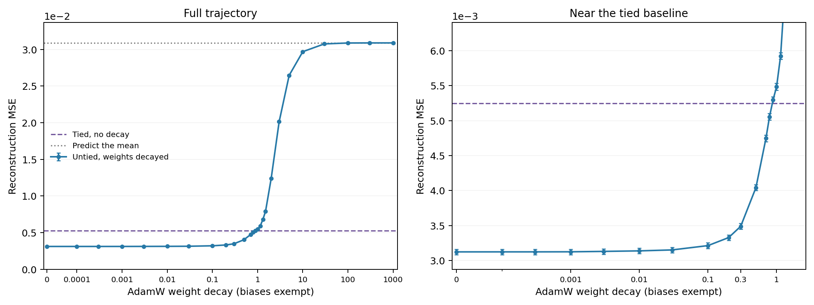

# Weight decay and the untied solution



The same five-feature, two-dimensional model at sparsity 0.9, retrained with AdamW weight decay.
Only encoder and decoder weights are decayed; output biases remain trainable and unpenalized.
MSE averages over examples and all five features; error bars show test-sampling 95% intervals.
The tied reference is an unregularized tied model, not a tied model retrained at each decay strength.

## Main results

- Zero decay: MSE 3.123530e-03, improvement 40.48% over tied.
- Tied reference: MSE 5.248081e-03.
- Predicting the population mean 0.05: population MSE 0.03083333, shared-test MSE 3.088640e-02.
- Weight decay 0.01: MSE 3.137872e-03, improvement 40.21% over tied.
- Tied-level loss is crossed between decay 0.7884 and 0.8879 (log-axis interpolation approximately 0.8678; not an exact threshold).
- At decay 1000: MSE 3.088630e-02; biases range from 0.04989 to 0.05009.

These are numerical training outcomes, not globally proven optima.
AdamW is decoupled weight shrinkage; its coefficient is not interchangeable with an explicit L2-penalty coefficient.
Crossing tied-level loss does not mean that the learned weights become tied.

## Full table

| Weight decay | Test MSE | Improvement over tied | Paired 95% interval | Total squared weight norm |
| ---: | ---: | ---: | ---: | ---: |
| 0 | 3.123530e-03 | +40.48% | [+40.03%, +40.93%] | 689.74 |
| 0.0001 | 3.123730e-03 | +40.48% | [+40.03%, +40.93%] | 678.66 |
| 0.0003 | 3.123821e-03 | +40.48% | [+40.03%, +40.93%] | 675.48 |
| 0.001 | 3.124686e-03 | +40.46% | [+40.01%, +40.91%] | 635.95 |
| 0.003 | 3.130360e-03 | +40.35% | [+39.64%, +41.06%] | 762.01 |
| 0.01 | 3.137872e-03 | +40.21% | [+39.50%, +40.92%] | 532.99 |
| 0.03 | 3.151479e-03 | +39.95% | [+39.24%, +40.66%] | 454.08 |
| 0.1 | 3.213213e-03 | +38.77% | [+38.06%, +39.49%] | 144 |
| 0.2 | 3.327870e-03 | +36.59% | [+35.86%, +37.32%] | 69.864 |
| 0.3 | 3.489298e-03 | +33.51% | [+32.63%, +34.40%] | 48.435 |
| 0.5 | 4.042113e-03 | +22.98% | [+22.59%, +23.37%] | 22.256 |
| 0.7 | 4.746462e-03 | +9.56% | [+8.48%, +10.64%] | 14.852 |
| 0.7884 | 5.054083e-03 | +3.70% | [+2.56%, +4.83%] | 12.806 |
| 0.8879 | 5.294484e-03 | -0.88% | [-1.06%, -0.71%] | 11.246 |
| 1 | 5.484387e-03 | -4.50% | [-4.65%, -4.35%] | 10.558 |
| 1.145 | 5.923975e-03 | -12.88% | [-13.17%, -12.59%] | 9.6193 |
| 1.31 | 6.801747e-03 | -29.60% | [-30.17%, -29.04%] | 8.4658 |
| 1.5 | 7.917471e-03 | -50.86% | [-52.11%, -49.62%] | 7.0176 |
| 2 | 1.240546e-02 | -136.38% | [-138.28%, -134.48%] | 4.6651 |
| 3 | 2.013847e-02 | -283.73% | [-286.73%, -280.74%] | 2.207 |
| 5 | 2.646035e-02 | -404.19% | [-408.30%, -400.08%] | 0.79547 |
| 10 | 2.968839e-02 | -465.70% | [-470.38%, -461.02%] | 0.19897 |
| 30 | 3.075036e-02 | -485.94% | [-490.80%, -481.07%] | 0.022075 |
| 100 | 3.087422e-02 | -488.30% | [-493.18%, -483.41%] | 0.0019766 |
| 300 | 3.088504e-02 | -488.50% | [-493.39%, -483.61%] | 0.00022079 |
| 1000 | 3.088630e-02 | -488.53% | [-493.41%, -483.64%] | 2.0097e-05 |

## Training protocol

Each initial coefficient has six starts: the pictured untied solution, the refined untied solution, tied weights, random weights, small random weights with mean biases, and untied weights with mean biases.
Positive-bias starts prevent zero-output ReLU states from being mistaken for the mean-prediction limit.
After the first pass, the best final model at each neighboring coefficient supplies warm starts from both lower and higher decay.
The best final result per coefficient and the pictured-model branch receive longer training.
Four additional coefficients near the preliminary tied-level crossing are initialized from both bounding solutions.
Checkpoint traces are diagnostic: the curve selects among final states of the longest runs, not among earlier checkpoints with lower reconstruction loss.
Training uses fresh samples, learning rate 0.001 held constant for half the run and cosine-decayed to 0.00001 thereafter; Adam betas=(0.9,0.999), epsilon=1e-8.
The per-model batched decay implementation is numerically checked against torch.optim.AdamW, including exact bias exemption.
Model selection uses 131,072 validation examples; every final point and both baselines share a separate test draw of one million examples.

- `explore_shard0`: 66 models, 30,000 steps, batch 2,048.
- `explore_shard1`: 66 models, 30,000 steps, batch 2,048.
- `continuation_shard0`: 21 models, 30,000 steps, batch 2,048.
- `continuation_shard1`: 21 models, 30,000 steps, batch 2,048.
- `refine_shard0`: 26 models, 60,000 steps, batch 4,096.
- `refine_shard1`: 25 models, 60,000 steps, batch 4,096.

Warm starts inherit earlier training; this is a search for stable solutions, not a matched-compute comparison.
The largest change in validation MSE over the final 5,000 steps among plotted models was 0.68%.
The original notebook applied decay to its output bias too; this sweep intentionally excludes biases as requested.

## Files

- [Summary, all curve points, and selected weights](summary.json).
- [Independent NumPy verification of the test MSEs](verification.json).
- `explore_*.json`, `continuation_*.json`, and `refine_*.json` retain all final models and convergence traces.
- Included reproduction scripts: `results/core/tied_untied/weight_decay_trajectory.py` and its helper `one_sided_norm_experiments.py`.

```sh
python results/core/tied_untied/weight_decay_trajectory.py --phase explore --shard 0
python results/core/tied_untied/weight_decay_trajectory.py --phase explore --shard 1
python results/core/tied_untied/weight_decay_trajectory.py --phase continuation --shard 0
python results/core/tied_untied/weight_decay_trajectory.py --phase continuation --shard 1
python results/core/tied_untied/weight_decay_trajectory.py --phase refine --shard 0 --steps 60000 --batch 4096
python results/core/tied_untied/weight_decay_trajectory.py --phase refine --shard 1 --steps 60000 --batch 4096
MPLCONFIGDIR=/tmp/weight-decay-mpl python results/core/tied_untied/weight_decay_trajectory.py --phase report
```
